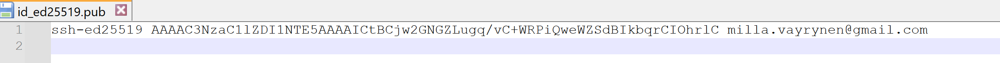
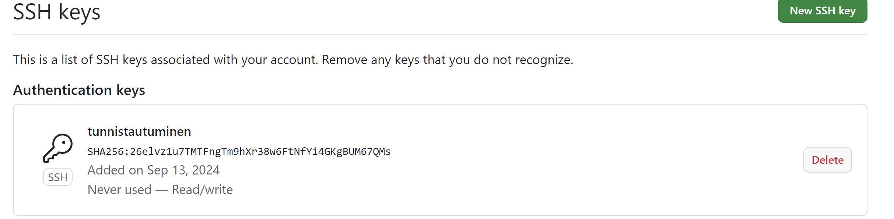

  


Start Powershell with Administrator rights (Run as Administrator)


**Run the following command in Powershell to install CHOCOLATEY**

```powershell
Set-ExecutionPolicy Bypass -Scope Process -Force; iwr https://community.chocolatey.org/install.ps1 -UseBasicParsing | iex
```

## Step 2: Programs/Apps Installation

After successfully installing the Chocolatey package manager, you can use it to install multiple apps simultaneously. This saves you significant time compared to installing each app individually. 

***The list of apps that you are going to install is as below:*** <br>

> powershell-core, git, vscode, putty,firefox, greenshot,google-drive-file-stream, googlechrome notepadplusplus, winscp, 7zip,  paint.net, windirstat, zoom, sudo, vmrc, vmware-horizon-client, github-desktop, docker-desktop & obs-studio powertoys signal spotify discord

***To install the above mentioned programs run the following script***

```powershell
choco install powershell-core git vscode putty greenshot notepadplusplus winscp 7zip paint.net windirstat zoom sudo vmrc vmware-horizon-client github-desktop obs-studio docker-desktop google-drive-file-stream googlechrome curl powertoys signal spotify discord -y

```


 
