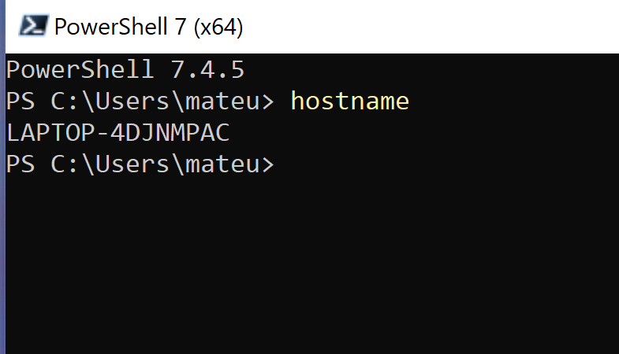

Start Powershell with Administrator rights (Run as Administrator)
    If you already have choco installed in your device, run the following command in your powershell 

!!! danger "This will remove chocolatey from your computer! For re-installing only!"
    ```powershell title="Powershell as Administrator"
    rm -Path "C:\ProgramData\chocolatey" -Recurse -Force
    rm -Path "C:\ProgramData\ChocolateyHttpCache" -Recurse -Force
    ```
**Lets understand what you did with above command:** 

- `#!powershell rm`: It deletes files or directories in this case it deletes the chocolatey directory.
- `#!powershell -erroraction 'silentlycontinue'`: This part of the command tells PowerShell to continue executing the script without displaying an error message if the removal encounters an error (e.g., if the directory doesn't exist).

**Run the following command in Powershell to install CHOCOLATEY**

```powershell
Set-ExecutionPolicy Bypass -Scope Process -Force; iwr https://community.chocolatey.org/install.ps1 -UseBasicParsing | iex
```

## Step 2: Programs/Apps Installation

After successfully installing the Chocolatey package manager, you can use it to install multiple apps simultaneously. This saves you significant time compared to installing each app individually. 

***The list of apps that you are going to install is as below:*** <br>

> powershell-core, git, vscode, putty,firefox, greenshot,google-drive-file-stream, googlechrome notepadplusplus, winscp, 7zip,  paint.net, windirstat, zoom, sudo, vmrc, vmware-horizon-client, github-desktop, docker-desktop & obs-studio powertoys

***To install the above mentioned programs run the following script***

```powershell
choco install powershell-core git vscode putty greenshot notepadplusplus winscp 7zip paint.net windirstat zoom sudo vmrc vmware-horizon-client github-desktop obs-studio docker-desktop google-drive-file-stream googlechrome curl powertoys signal spotify discord -y


 